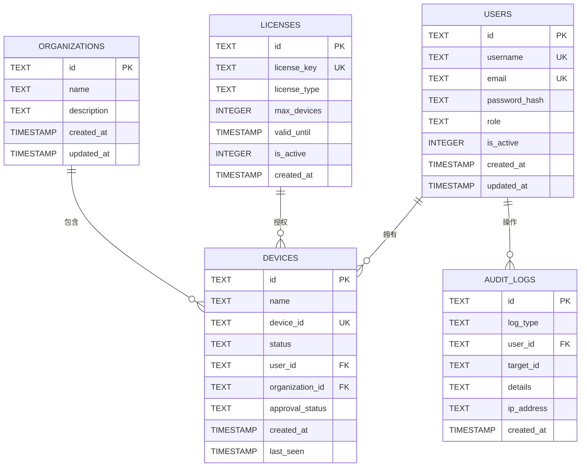
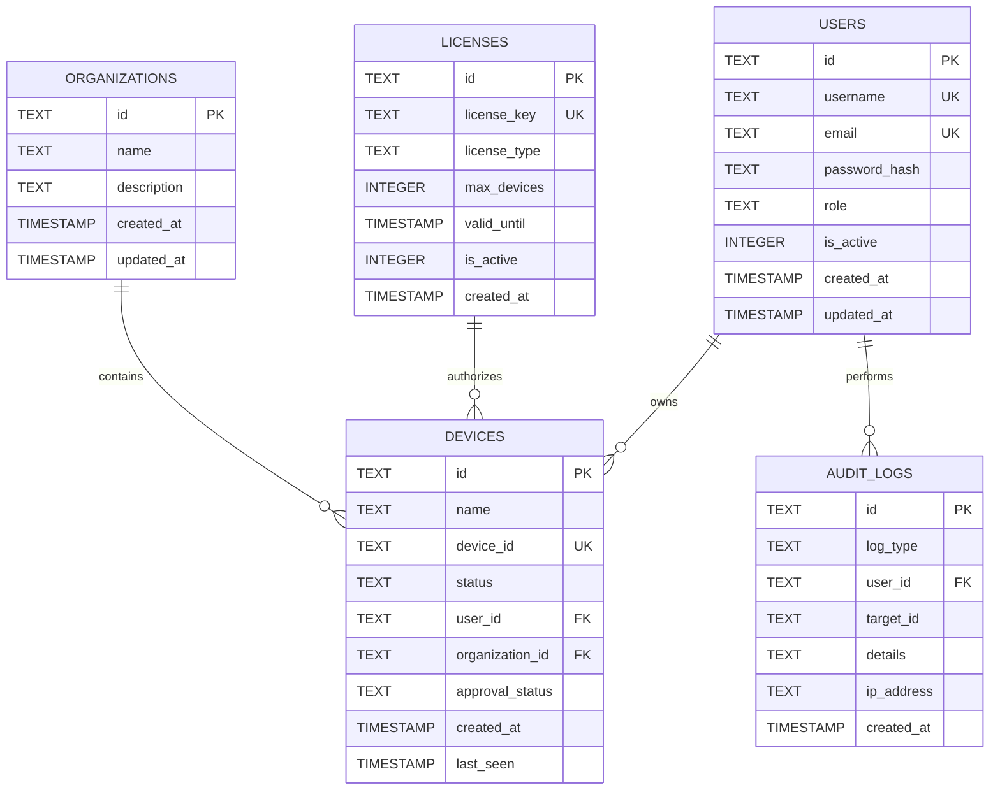

# RustDesk Pro Server 数据库设计文档

## 目录

1. [概述](#1-概述)
2. [数据库选型](#2-数据库选型)
3. [实体关系图](#3-实体关系图)
4. [表结构设计](#4-表结构设计)
5. [索引设计](#5-索引设计)
6. [数据字典](#6-数据字典)
7. [数据库操作](#7-数据库操作)
8. [数据迁移](#8-数据迁移)
9. [备份与恢复](#9-备份与恢复)

---

## 1. 概述

本文档描述 RustDesk Pro Server 的数据库设计，包括表结构、字段定义、索引设计和数据关系。

---

## 2. 数据库选型

| 特性 | SQLite | 说明 |
|------|--------|------|
| 类型 | 嵌入式关系数据库 | 无需独立服务 |
| 适用场景 | 单机部署、轻量级应用 | 适合中小型部署 |
| 并发支持 | 读写锁 | 适合中等并发场景 |
| 事务支持 | ACID | 完整事务支持 |
| 数据文件 | 单文件 | 易于备份和迁移 |

---

## 3. 实体关系图



---

## 4. 表结构设计

### 4.1 users 表（用户表）

| 字段名 | 类型 | 约束 | 说明 |
|--------|------|------|------|
| id | TEXT | PRIMARY KEY | 用户唯一标识 |
| username | TEXT | UNIQUE NOT NULL | 用户名 |
| email | TEXT | UNIQUE NOT NULL | 邮箱地址 |
| password_hash | TEXT | NOT NULL | 密码哈希（bcrypt） |
| role | TEXT | NOT NULL DEFAULT 'viewer' | 角色（admin/operator/viewer） |
| is_active | INTEGER | NOT NULL DEFAULT 1 | 是否激活（1=是，0=否） |
| created_at | TIMESTAMP | DEFAULT CURRENT_TIMESTAMP | 创建时间 |
| updated_at | TIMESTAMP | DEFAULT CURRENT_TIMESTAMP | 更新时间 |

**DDL**:
```sql
CREATE TABLE IF NOT EXISTS users (
    id TEXT PRIMARY KEY NOT NULL,
    username TEXT NOT NULL UNIQUE,
    email TEXT NOT NULL UNIQUE,
    password_hash TEXT NOT NULL,
    role TEXT NOT NULL DEFAULT 'viewer',
    is_active INTEGER NOT NULL DEFAULT 1,
    created_at TIMESTAMP DEFAULT CURRENT_TIMESTAMP,
    updated_at TIMESTAMP DEFAULT CURRENT_TIMESTAMP
);
```

### 4.2 devices 表（设备表）

| 字段名 | 类型 | 约束 | 说明 |
|--------|------|------|------|
| id | TEXT | PRIMARY KEY | 设备唯一标识 |
| name | TEXT | NOT NULL | 设备名称 |
| device_id | TEXT | UNIQUE NOT NULL | 设备硬件标识 |
| status | TEXT | NOT NULL DEFAULT 'offline' | 状态（online/offline/away） |
| user_id | TEXT | FOREIGN KEY | 所属用户ID |
| organization_id | TEXT | FOREIGN KEY | 所属组织ID |
| approval_status | TEXT | NOT NULL DEFAULT 'pending' | 审批状态（pending/approved/rejected） |
| created_at | TIMESTAMP | DEFAULT CURRENT_TIMESTAMP | 创建时间 |
| last_seen | TIMESTAMP | DEFAULT CURRENT_TIMESTAMP | 最后在线时间 |

**DDL**:
```sql
CREATE TABLE IF NOT EXISTS devices (
    id TEXT PRIMARY KEY NOT NULL,
    name TEXT NOT NULL,
    device_id TEXT NOT NULL UNIQUE,
    status TEXT NOT NULL DEFAULT 'offline',
    user_id TEXT,
    organization_id TEXT,
    approval_status TEXT NOT NULL DEFAULT 'pending',
    created_at TIMESTAMP DEFAULT CURRENT_TIMESTAMP,
    last_seen TIMESTAMP DEFAULT CURRENT_TIMESTAMP,
    FOREIGN KEY (user_id) REFERENCES users(id),
    FOREIGN KEY (organization_id) REFERENCES organizations(id)
);
```

### 4.3 licenses 表（许可证表）

| 字段名 | 类型 | 约束 | 说明 |
|--------|------|------|------|
| id | TEXT | PRIMARY KEY | 许可证唯一标识 |
| license_key | TEXT | UNIQUE NOT NULL | 许可证密钥 |
| license_type | TEXT | NOT NULL | 类型（basic/pro/enterprise） |
| max_devices | INTEGER | NOT NULL DEFAULT 10 | 最大设备数 |
| valid_until | TIMESTAMP | NOT NULL | 有效期截止时间 |
| is_active | INTEGER | NOT NULL DEFAULT 1 | 是否激活 |
| created_at | TIMESTAMP | DEFAULT CURRENT_TIMESTAMP | 创建时间 |

**DDL**:
```sql
CREATE TABLE IF NOT EXISTS licenses (
    id TEXT PRIMARY KEY NOT NULL,
    license_key TEXT NOT NULL UNIQUE,
    license_type TEXT NOT NULL,
    max_devices INTEGER NOT NULL DEFAULT 10,
    valid_until TIMESTAMP NOT NULL,
    is_active INTEGER NOT NULL DEFAULT 1,
    created_at TIMESTAMP DEFAULT CURRENT_TIMESTAMP
);
```

### 4.4 organizations 表（组织表）

| 字段名 | 类型 | 约束 | 说明 |
|--------|------|------|------|
| id | TEXT | PRIMARY KEY | 组织唯一标识 |
| name | TEXT | NOT NULL | 组织名称 |
| description | TEXT | | 组织描述 |
| created_at | TIMESTAMP | DEFAULT CURRENT_TIMESTAMP | 创建时间 |
| updated_at | TIMESTAMP | DEFAULT CURRENT_TIMESTAMP | 更新时间 |

**DDL**:
```sql
CREATE TABLE IF NOT EXISTS organizations (
    id TEXT PRIMARY KEY NOT NULL,
    name TEXT NOT NULL,
    description TEXT,
    created_at TIMESTAMP DEFAULT CURRENT_TIMESTAMP,
    updated_at TIMESTAMP DEFAULT CURRENT_TIMESTAMP
);
```

### 4.5 audit_logs 表（审计日志表）

| 字段名 | 类型 | 约束 | 说明 |
|--------|------|------|------|
| id | TEXT | PRIMARY KEY | 日志唯一标识 |
| log_type | TEXT | NOT NULL | 日志类型 |
| user_id | TEXT | FOREIGN KEY | 操作用户ID |
| target_id | TEXT | | 目标资源ID |
| details | TEXT | | 详细信息（JSON） |
| ip_address | TEXT | | 客户端IP地址 |
| created_at | TIMESTAMP | DEFAULT CURRENT_TIMESTAMP | 创建时间 |

**DDL**:
```sql
CREATE TABLE IF NOT EXISTS audit_logs (
    id TEXT PRIMARY KEY NOT NULL,
    log_type TEXT NOT NULL,
    user_id TEXT,
    target_id TEXT,
    details TEXT,
    ip_address TEXT,
    created_at TIMESTAMP DEFAULT CURRENT_TIMESTAMP,
    FOREIGN KEY (user_id) REFERENCES users(id)
);
```

---

## 5. 索引设计

### 5.1 索引列表

| 表名 | 索引名 | 字段 | 类型 | 说明 |
|------|--------|------|------|------|
| users | idx_users_username | username | UNIQUE | 加速用户名校验 |
| users | idx_users_email | email | UNIQUE | 加速邮箱校验 |
| users | idx_users_role | role | INDEX | 加速角色筛选 |
| devices | idx_devices_device_id | device_id | UNIQUE | 加速设备查找 |
| devices | idx_devices_user_id | user_id | INDEX | 加速用户设备查询 |
| devices | idx_devices_status | status | INDEX | 加速状态筛选 |
| devices | idx_devices_approval_status | approval_status | INDEX | 加速审批状态筛选 |
| licenses | idx_licenses_key | license_key | UNIQUE | 加速许可证验证 |
| licenses | idx_licenses_type | license_type | INDEX | 加速类型筛选 |
| audit_logs | idx_audit_log_type | log_type | INDEX | 加速日志类型筛选 |
| audit_logs | idx_audit_user_id | user_id | INDEX | 加速用户日志查询 |
| audit_logs | idx_audit_created_at | created_at | INDEX | 加速时间范围查询 |

### 5.2 索引创建脚本

```sql
-- 用户表索引
CREATE INDEX IF NOT EXISTS idx_users_role ON users(role);

-- 设备表索引
CREATE INDEX IF NOT EXISTS idx_devices_user_id ON devices(user_id);
CREATE INDEX IF NOT EXISTS idx_devices_status ON devices(status);
CREATE INDEX IF NOT EXISTS idx_devices_approval_status ON devices(approval_status);

-- 许可证表索引
CREATE INDEX IF NOT EXISTS idx_licenses_type ON licenses(license_type);

-- 审计日志表索引
CREATE INDEX IF NOT EXISTS idx_audit_log_type ON audit_logs(log_type);
CREATE INDEX IF NOT EXISTS idx_audit_user_id ON audit_logs(user_id);
CREATE INDEX IF NOT EXISTS idx_audit_created_at ON audit_logs(created_at);
```

---

## 6. 数据字典

### 6.1 枚举值定义

#### 6.1.1 用户角色 (role)

| 值 | 说明 | 权限 |
|------|------|------|
| admin | 管理员 | 完整权限 |
| operator | 操作员 | 操作权限 |
| viewer | 查看者 | 只读权限 |

#### 6.1.2 设备状态 (status)

| 值 | 说明 |
|------|------|
| online | 在线 |
| offline | 离线 |
| away | 离开 |

#### 6.1.3 设备审批状态 (approval_status)

| 值 | 说明 |
|------|------|
| pending | 待审批 |
| approved | 已批准 |
| rejected | 已拒绝 |

#### 6.1.4 许可证类型 (license_type)

| 值 | 说明 |
|------|------|
| basic | 基础版 |
| pro | 专业版 |
| enterprise | 企业版 |

#### 6.1.5 审计日志类型 (log_type)

| 值 | 说明 |
|------|------|
| login | 用户登录 |
| logout | 用户登出 |
| user_create | 创建用户 |
| user_update | 更新用户 |
| user_delete | 删除用户 |
| device_register | 设备注册 |
| device_approve | 设备审批 |
| device_delete | 删除设备 |
| license_generate | 生成许可证 |
| license_validate | 验证许可证 |
| config_update | 配置更新 |

---

## 7. 数据库操作

### 7.1 初始化脚本

```sql
-- 创建所有表
CREATE TABLE IF NOT EXISTS users (...);
CREATE TABLE IF NOT EXISTS devices (...);
CREATE TABLE IF NOT EXISTS licenses (...);
CREATE TABLE IF NOT EXISTS organizations (...);
CREATE TABLE IF NOT EXISTS audit_logs (...);

-- 创建索引
CREATE INDEX IF NOT EXISTS idx_users_role ON users(role);
-- ... 其他索引

-- 创建管理员用户
INSERT OR IGNORE INTO users (id, username, email, password_hash, role)
VALUES (
    'admin',
    'admin',
    'admin@rustdesk.local',
    '$2b$10$N9qo8uLOickgx2ZMRZoMye...', -- bcrypt hash of 'admin123'
    'admin'
);
```

### 7.2 常用查询

#### 7.2.1 查询在线设备

```sql
SELECT * FROM devices 
WHERE status = 'online' 
ORDER BY last_seen DESC;
```

#### 7.2.2 查询待审批设备

```sql
SELECT d.*, u.username 
FROM devices d
LEFT JOIN users u ON d.user_id = u.id
WHERE d.approval_status = 'pending';
```

#### 7.2.3 查询用户操作日志

```sql
SELECT * FROM audit_logs 
WHERE user_id = 'user_id' 
ORDER BY created_at DESC 
LIMIT 100;
```

#### 7.2.4 统计各状态设备数量

```sql
SELECT status, COUNT(*) as count 
FROM devices 
GROUP BY status;
```

---

## 8. 数据迁移

### 8.1 迁移流程

```
备份数据库 → 执行迁移脚本 → 验证数据 → 更新应用
```

### 8.2 迁移脚本示例

```sql
-- migration_001_add_organization.sql
ALTER TABLE devices 
ADD COLUMN organization_id TEXT;

CREATE TABLE IF NOT EXISTS organizations (
    id TEXT PRIMARY KEY NOT NULL,
    name TEXT NOT NULL,
    description TEXT,
    created_at TIMESTAMP DEFAULT CURRENT_TIMESTAMP,
    updated_at TIMESTAMP DEFAULT CURRENT_TIMESTAMP
);
```

---

## 9. 备份与恢复

### 9.1 备份命令

```bash
# 备份数据库文件
cp data/rustdesk_pro.db data/rustdesk_pro.db.backup

# 使用 sqlite3 导出
sqlite3 data/rustdesk_pro.db ".backup backup/rustdesk_pro.db"

# 导出为 SQL
sqlite3 data/rustdesk_pro.db ".dump" > backup/rustdesk_pro.sql
```

### 9.2 恢复命令

```bash
# 恢复数据库文件
cp backup/rustdesk_pro.db data/rustdesk_pro.db

# 从 SQL 导入
sqlite3 data/rustdesk_pro.db < backup/rustdesk_pro.sql
```

---

## 附录：ER 图源码

