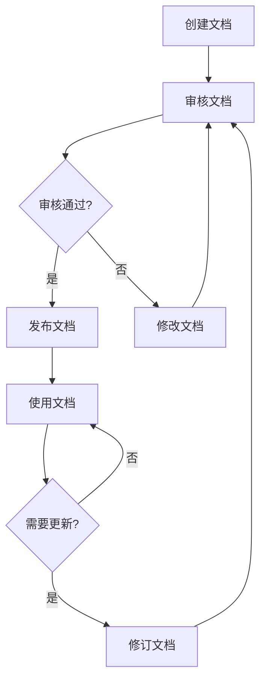
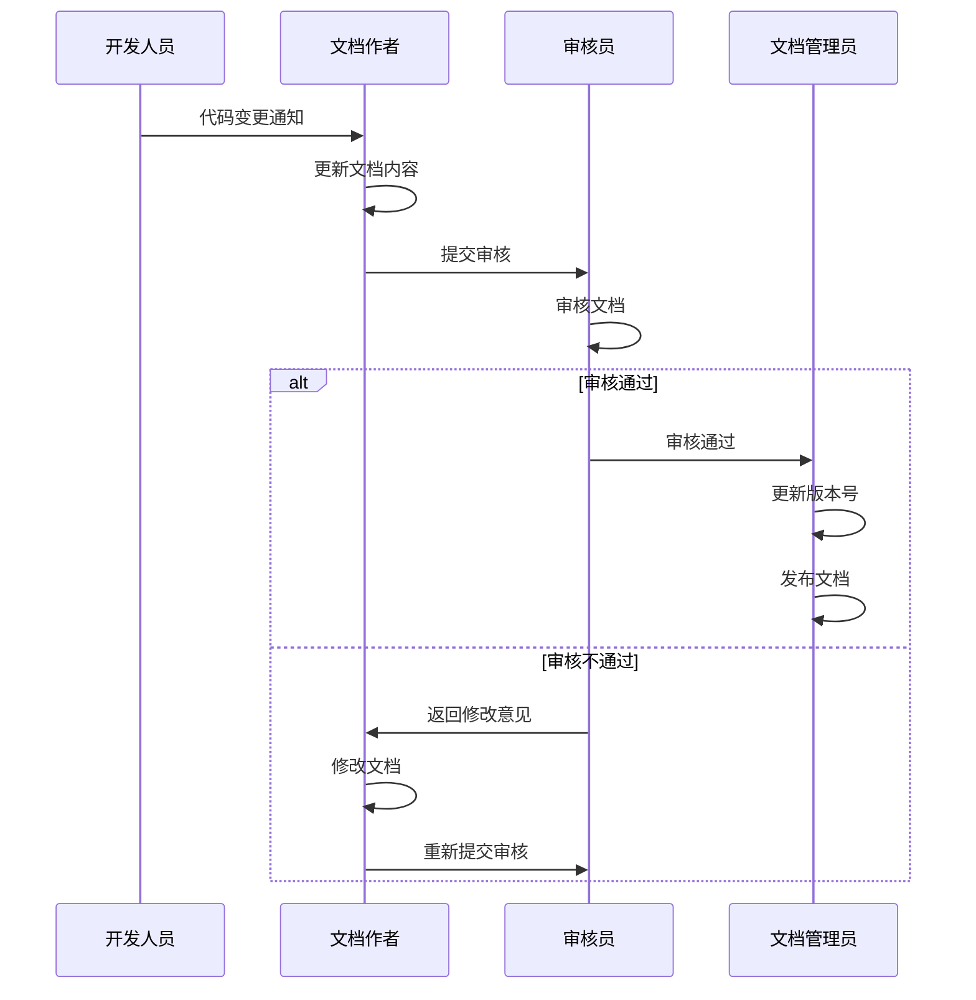

# RustDesk Pro Server 文档版本控制机制

## 目录

1. [概述](#1-概述)
2. [文档管理流程](#2-文档管理流程)
3. [版本控制规范](#3-版本控制规范)
4. [文档审核流程](#4-文档审核流程)
5. [文档更新流程](#5-文档更新流程)
6. [变更历史记录](#6-变更历史记录)
7. [文档状态说明](#7-文档状态说明)

---

## 1. 概述

本文档定义 RustDesk Pro Server 项目的文档版本控制机制，确保文档的完整性、准确性和可追溯性。

---

## 2. 文档管理流程



---

## 3. 版本控制规范

### 3.1 版本号格式

```
主版本号.次版本号.修订号
例如：1.0.0
```

| 级别 | 变更类型 | 说明 |
|------|----------|------|
| 主版本号 | 重大重构 | 文档结构或内容发生根本性变化 |
| 次版本号 | 功能新增 | 添加新章节或新内容 |
| 修订号 | 错误修正 | 修改错误或优化表述 |

### 3.2 文件命名规范

```
{文档类型}_{版本号}.md
示例：ARCHITECTURE_v1.0.0.md
```

### 3.3 文档元数据

每个文档开头必须包含以下元数据：

```markdown
---
title: 文档标题
version: 1.0.0
last_updated: 2024-01-15
author: 张三
status: 发布
reviewer: 李四
---
```

### 3.4 版本标签

在 Git 中使用标签标记文档版本：

```bash
# 创建版本标签
git tag -a v1.0.0 -m "文档版本 1.0.0"

# 推送标签
git push origin v1.0.0

# 查看标签
git tag -l
```

---

## 4. 文档审核流程

### 4.1 审核角色

| 角色 | 职责 |
|------|------|
| 文档作者 | 创建和更新文档 |
| 技术审核员 | 审核技术准确性 |
| 质量保证员 | 审核文档完整性 |
| 文档管理员 | 管理文档发布流程 |

### 4.2 审核标准

| 检查项 | 标准 |
|--------|------|
| 准确性 | 技术内容正确无误 |
| 完整性 | 覆盖所有必要内容 |
| 可读性 | 语言通顺、格式规范 |
| 一致性 | 与代码实现保持一致 |
| 安全性 | 不包含敏感信息 |

### 4.3 审核步骤

1. 作者提交文档审核申请
2. 技术审核员审核技术内容
3. 质量保证员审核文档质量
4. 文档管理员确认审核通过
5. 发布文档

---

## 5. 文档更新流程

### 5.1 更新触发条件

- 代码实现变更
- 功能需求变更
- 用户反馈问题
- 定期审查发现问题

### 5.2 更新步骤



### 5.3 更新记录

每次更新必须记录：

| 字段 | 说明 |
|------|------|
| 版本号 | 更新后的版本号 |
| 更新日期 | 更新时间 |
| 更新内容 | 详细变更描述 |
| 更新人 | 执行更新的人员 |
| 审核人 | 审核人员 |

---

## 6. 变更历史记录

### 6.1 文档变更记录格式

| 日期 | 文档名称 | 版本 | 更新内容 | 更新人 | 审核人 |
|------|----------|------|----------|--------|--------|
| 2024-01-15 | ARCHITECTURE.md | 1.0.0 | 初始版本 | 张三 | 李四 |
| 2024-01-22 | ARCHITECTURE.md | 1.0.1 | 修复数据库设计错误 | 张三 | 李四 |
| 2024-02-05 | API.md | 1.1.0 | 新增设备审批接口 | 王五 | 赵六 |

### 6.2 项目文档变更日志

#### ARCHITECTURE.md

| 版本 | 日期 | 变更内容 |
|------|------|----------|
| 1.0.0 | 2024-01-15 | 初始版本，包含整体架构设计 |
| 1.0.1 | 2024-01-22 | 修正数据库表结构设计 |
| 1.1.0 | 2024-02-05 | 添加监控告警架构说明 |

#### API.md

| 版本 | 日期 | 变更内容 |
|------|------|----------|
| 1.0.0 | 2024-01-15 | 初始版本，包含认证和用户接口 |
| 1.1.0 | 2024-02-05 | 添加设备审批接口 |
| 1.2.0 | 2024-03-01 | 添加审计日志接口 |

#### DATABASE.md

| 版本 | 日期 | 变更内容 |
|------|------|----------|
| 1.0.0 | 2024-01-15 | 初始版本，包含表结构设计 |
| 1.0.1 | 2024-01-22 | 添加索引设计 |

#### DEPLOYMENT.md

| 版本 | 日期 | 变更内容 |
|------|------|----------|
| 1.0.0 | 2024-01-15 | 初始版本，包含 Docker 部署 |
| 1.1.0 | 2024-02-05 | 添加 Podman 部署 |
| 1.2.0 | 2024-03-01 | 添加 Kubernetes 部署 |

#### DEVELOPMENT.md

| 版本 | 日期 | 变更内容 |
|------|------|----------|
| 1.0.0 | 2024-01-15 | 初始版本，开发环境搭建指南 |

#### CODING_STANDARDS.md

| 版本 | 日期 | 变更内容 |
|------|------|----------|
| 1.0.0 | 2024-01-15 | 初始版本，代码规范 |

#### CHANGELOG.md

| 版本 | 日期 | 变更内容 |
|------|------|----------|
| 1.0.0 | 2024-01-15 | 初始版本 |
| 1.0.1 | 2024-01-22 | 更新版本记录 |

#### USER_MANUAL.md

| 版本 | 日期 | 变更内容 |
|------|------|----------|
| 1.0.0 | 2024-01-15 | 初始版本，用户操作指南 |

#### FEATURES.md

| 版本 | 日期 | 变更内容 |
|------|------|----------|
| 1.0.0 | 2024-01-15 | 初始版本，功能对比文档 |

#### USAGE.md

| 版本 | 日期 | 变更内容 |
|------|------|----------|
| 1.0.0 | 2024-01-15 | 初始版本，API 使用文档 |

---

## 7. 文档状态说明

| 状态 | 说明 | 图标 |
|------|------|------|
| 草稿 | 正在编写中，未完成 | 📝 |
| 审核中 | 等待审核 | 🔍 |
| 已批准 | 审核通过，待发布 | ✅ |
| 发布 | 正式发布，可使用 | 🚀 |
| 废弃 | 不再使用 | 🗑️ |

---

## 附录：文档管理工具

### 工具列表

| 工具 | 用途 |
|------|------|
| Git | 版本控制 |
| Markdown | 文档格式 |
| MkDocs | 文档网站生成 |
| Swagger UI | API 文档可视化 |

### 文档目录结构

```
docs/
├── ARCHITECTURE.md      # 系统架构文档
├── API.md               # API 接口文档
├── DATABASE.md          # 数据库设计文档
├── DEPLOYMENT.md        # 部署文档
├── DEVELOPMENT.md       # 开发环境搭建指南
├── CODING_STANDARDS.md  # 代码规范文档
├── CHANGELOG.md         # 版本更新日志
├── USER_MANUAL.md       # 用户操作手册
├── FEATURES.md          # 功能开发文档
├── USAGE.md             # 使用文档
└── DOCUMENT_CONTROL.md  # 文档版本控制机制
```

---

## 附录：文档审核检查清单

### 技术准确性
- [ ] 技术描述准确无误
- [ ] 代码示例可运行
- [ ] 配置参数正确
- [ ] 架构图与实现一致

### 文档完整性
- [ ] 包含必要章节
- [ ] 有清晰的目录结构
- [ ] 包含示例代码
- [ ] 包含错误处理说明

### 文档质量
- [ ] 语言通顺易懂
- [ ] 格式规范统一
- [ ] 没有拼写错误
- [ ] 版本号正确

### 安全检查
- [ ] 不包含敏感信息
- [ ] 不包含硬编码密码
- [ ] 不包含内部 IP 地址